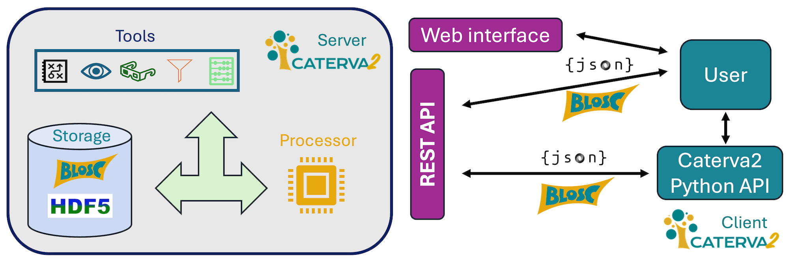

# Caterva2: On-demand access to Blosc2/HDF5 data repositories

## What is it?

Caterva2 is a service for sharing [Blosc2][] and [HDF5][] datasets with authenticated users, work groups, or the public. It provides multiple interfaces: web GUI, REST API, Python API, and command-line client.



Use it remotely or locally to access datasets in a directory hierarchy or share them across your network.


The Python API is recommended for building custom clients, while the web GUI offers a user-friendly interface for browsing datasets.


[Blosc2]: https://www.blosc.org/pages/blosc-in-depth/
    "What Is Blosc? (Blosc blog)"

[HDF5]: https://www.hdfgroup.org/solutions/hdf5/
    "HDF5 (HDF Group)"

## Caterva2 Clients

The Caterva2 package provides a lightweight library for building custom clients. Choose the interface that best fits your needs:

- **[Web GUI](https://ironarray.io/caterva2-doc/tutorials/web-client.html)** - Browser-based interface
  

- **[Python API](https://ironarray.io/caterva2-doc/tutorials/API.html)** - Programmatic access
  ```python
  import caterva2 as cat2

  client = cat2.Client("https://cat2.cloud/demo")
  print(client.get("@public/examples/numbers_color.b2nd")[2])
  ```

- **[Command-line client](https://ironarray.io/caterva2-doc/tutorials/cli.html)** - Terminal interface
  ```sh
  cat2-client --server https://cat2.cloud/demo info @public/examples/numbers_color.b2nd
  ```

- **[REST API](https://ironarray.io/caterva2-doc/tutorials/RESTAPI.html)** - HTTP interface (use with [Postman](https://www.postman.com/), [curl](https://curl.se/), etc.)
  See the live API docs at [cat2.cloud/demo/docs](https://cat2.cloud/demo/docs).

All interfaces support authentication for accessing private datasets (see "User authentication" below).

## Installation

### For Users

**Client only** (Python API and CLI tools):
```sh
pip install caterva2[clients]
```

**Test the installation** (includes client, server, and test suite):
```sh
pip install caterva2[tests]
python -m caterva2.tests
CATERVA2_SECRET=c2sikrit python -m caterva2.tests  # with authentication
```

### For Developers

**Install from source** (includes server, clients, and test suite):
```sh
git clone https://github.com/ironArray/Caterva2
cd Caterva2
pip install -e .[tests]
python -m pytest
CATERVA2_SECRET=c2sikrit python -m pytest  # with authentication
```

### Available Extras

Append `[extra1,extra2,...]` to any install command:

- `clients` - CLI and terminal tools
- `server` - Server service
- `tests` - Test suite (includes server and clients)
- `blosc2-plugins` - JPEG 2000 support via blosc2-grok

**Note:** Test runs create a `_caterva2_tests` directory with state files for inspection.

## Quick start

See [Caterva2 documentation](https://ironarray.io/caterva2-doc/index.html) for detailed tutorials.

**Setup:**
1. Install with server and client support:
   ```sh
   pip install caterva2[server,clients]
   ```

2. Copy configuration files:
   - `caterva2.sample.toml` → `caterva2.toml` (client config)
   - `caterva2-server.sample.toml` → `caterva2-server.toml` (server config)

   Place in current directory, `~/`, or `/etc/`. Use `--conf` to specify alternate locations.

3. Start the server:
   ```sh
   CATERVA2_SECRET=c2sikrit cat2-server &
   ```
   `CATERVA2_SECRET` is required for user authentication (see below).

**Server directory structure:**

```sh
tree _caterva2
_caterva2
└── state
    ├── db.json          # metadata
    ├── db.sqlite        # metadata
    ├── media            # temporary files for web GUI
    ├── personal         # user-specific datasets
    ├── public           # publicly shared datasets
    └── shared           # group-shared datasets
```

**Populate with example datasets:**

```sh
cp -r root-example/ _caterva2/state/public/
```

Browse them at [http://localhost:8000/?roots=@public](http://localhost:8000/?roots=@public)

### User authentication

Enable authentication by setting `CATERVA2_SECRET` when starting the server. This enables user management but does not verify email addresses or support password recovery.

**Create a user:**
```sh
cat2-admin adduser user@example.com foobar11
```

**Authenticate clients:**
- **Web GUI** - Login prompt on access
- **Python API** - Pass credentials to client:
  ```python
  client = cat2.Client("http://localhost:8000", ("user@example.com", "foobar11"))
  ```
- **CLI** - Use `--user` and `--pass` options

### Command-line client

**List roots:**
```sh
cat2-client --user user@example.com --pass foobar11 roots
# Output: @public, @personal, @shared
```

**Upload a dataset:**
```sh
cat2-client --user user@example.com --pass foobar11 upload root-example/ds-1d.b2nd @personal/ds-1d.b2nd
```

**Get dataset info:**
```sh
cat2-client --user user@example.com --pass foobar11 info @personal/ds-1d.b2nd
# Returns: shape, chunks, dtype, compression params, etc.
```

**Browse directory tree:**
```sh
cat2-client --user user@example.com --pass foobar11 tree @public
```

For more commands: `cat2-client --help`

## Documentation

For tutorials, API references, and examples, visit the [Caterva2 documentation](https://ironarray.io/caterva2-doc/index.html).
