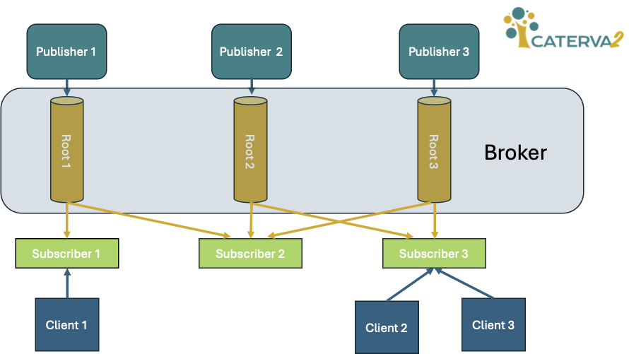
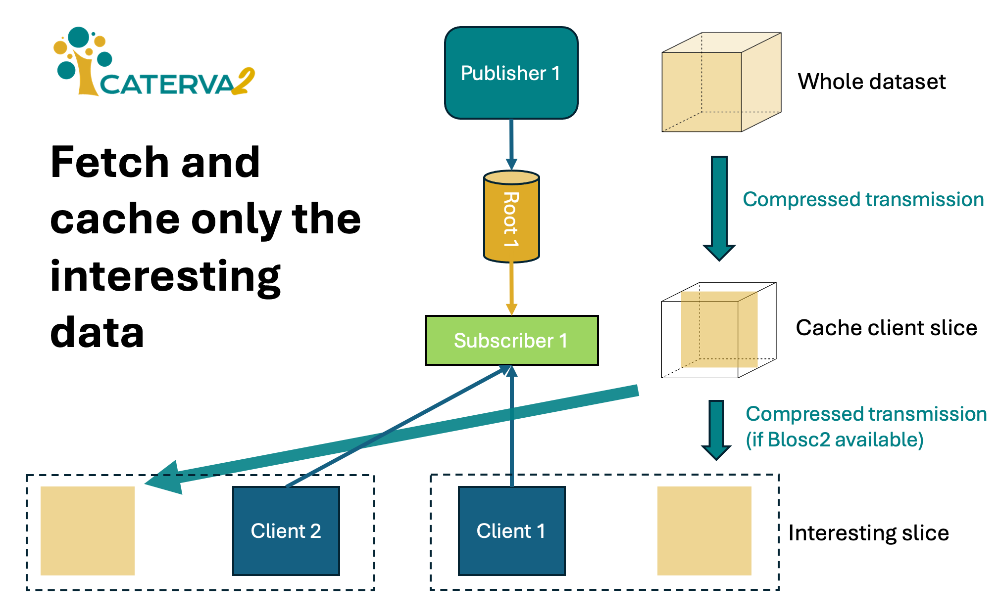

# Caterva2: On-demand access to Blosc2 data repositories

## What is it?

Caterva2 is a distributed system written in Python meant for sharing [Blosc2][] datasets (either native or converted on-the-fly from HDF5) among different hosts by using a [publish–subscribe][] messaging pattern.  Here, publishers categorize datasets into root groups that are announced to the broker and propagated to subscribers.  Also, every subscriber exposes a REST interface that allows clients to access the datasets.



[Blosc2]: https://www.blosc.org/pages/blosc-in-depth/
    "What Is Blosc? (Blosc blog)"

[publish–subscribe]: https://en.wikipedia.org/wiki/Publish–subscribe_pattern
    "Publish–subscribe pattern (Wikipedia)"

Caterva2 subscribers perform on demand data access with local caching (fit for re-publishing), which can be particularly useful for the efficient sharing of remote datasets locally, thus optimizing communication and storage resources within work groups.



## Components of Caterva2

A Caterva2 deployment includes:

- One **broker** service to enable the communication between publishers and subscribers.
- Several **publishers**, each one providing subscribers with access to one root and the datasets that it contains. The root may be a native Caterva2 directory with Blosc2 and plain files, or an HDF5 file (support for other formats may be added).
- Several **subscribers**, each one tracking changes in multiple roots and datasets from publishers, and caching them locally for efficient reuse.
- Several **clients**, each one asking a subscriber to track roots and datasets, and provide access to their data and metadata.

Publishers and subscribers may be apart, in different networks with limited or expensive connectivity between them, while subscribers and clients will usually be close enough to have fast and cheap connectivity (e.g. a local network).

The Caterva2 package includes all the aforementioned components, although its main role is to provide a very simple and lightweight library to build your own Caterva2 clients.

## Use with caution

Currently, this project is in early alpha stage, and it is not meant for production use yet.  In case you are interested in Caterva2, please contact us at <contact@blosc.org>.

## Installation

You may install Caterva2 in several ways:.

- Pre-built wheel from PyPI:

  ```sh
  python -m pip install caterva2
  ```

- Wheel built from source code:

  ```sh
  git clone https://github.com/Blosc/Caterva2
  cd Caterva2
  python -m build
  python -m pip install dist/caterva2-*.whl
  ```

- Developer setup:

  ```sh
  git clone https://github.com/Blosc/Caterva2
  cd Caterva2
  python -m pip install -e .
  ```

In any case, if you intend to run Caterva2 services, client programs, or the test suite, you need to enable the proper extra features by appending `[feature1,feature2...]` to the last argument of `pip` commands above.  The following extras are supported:

- `services` for running Caterva2 services (broker, publisher, subscriber)
- `clients` to use Caterva2 client programs (command-line or terminal)
- `hdf5` to enable serving HDF5 files as Caterva2 roots at the publisher
- `blosc2-plugins` to enable extra Blosc2 features like Btune or JPEG 2000 support
- `plugins` to enable Web client features like the tomography display
- `tools` for additional utilities like `cat2import` and `cat2export` (see below)
- `tests` if you want to run the Caterva2 test suite

### Testing

After installing with the `[tests]` extra, you can quickly check that the package is sane by running the test suite (that comes with the package):

```sh
python -m caterva2.tests -v
```

You may also run tests from source code:

```sh
cd Caterva2
python -m pytest -v
```

Tests will use a copy of Caterva2's `root-example` directory.  After they finish, state files will be left under the `_caterva2_tests` directory for inspection (it will be re-created when tests are run again).

In case you want to run the tests with your own running daemons, you can do:

```shell
env CATERVA2_USE_EXTERNAL=1 python -m caterva2.tests -v
```

Neither `root-example` nor `_caterva2_tests` will be used in this case.

## Quick start

(Find more detailed step-by-step [tutorials](Tutorials) in Caterva2 documentation.)

For the purpose of this quick start, let's use the datasets within the `root-example` folder:

```sh
cd Caterva2
ls -F root-example/
```

```
README.md  dir1/  dir2/  ds-1d-b.b2nd  ds-1d.b2nd  ds-hello.b2frame
```

First, create a virtual environment and install Caterva2 with the `[services,clients]` extras (see above).  Then fire up the broker, start publishing a root named `foo` with `root-example` datasets, and create a subscriber:

```sh
cat2bro &  # broker
cat2pub foo root-example &  # publisher
cat2sub &  # subscriber
```

(To stop them later on, bring each one to the foreground with `fg` and press Ctrl+C.)

### HDF5 roots

If you want to try and publish your own HDF5 file as a root, you need to include the `hdf5` extra in your Caterva2 installation.  Then you may just run:

```sh
cat2pub foo /path/to/your-file.h5 &
```

You can also get an example HDF5 file with some datasets by running:

```sh
python -m caterva2.services.hdf5root root-example.h5
```

You may want to test compatibility with [silx' HDF5 examples](https://www.silx.org/pub/h5web/) (`epics.h5` and `grove.h5` are quite illustrative).

### The command line client

Now that the services are running, we can use the `cat2cli` client to talk
to the subscriber. In another shell, let's list all the available roots in the system:

```sh
cat2cli roots
```

```
foo
```

We only have the `foo` root that we started publishing. If other publishers were running,
we would see them listed here too.

Let's ask our local subscriber to subscribe to the `foo` root:

```sh
cat2cli subscribe foo  # -> Ok
```

Now, one can list the datasets in the `foo` root:

```sh
cat2cli list foo
```

```
foo/README.md
...
foo/ds-hello.b2frame
...
foo/dir2/ds-4d.b2nd
```

Let's ask the subscriber for more info about the `foo/dir2/ds-4d.b2nd` dataset:

```sh
cat2cli info foo/dir2/ds-4d.b2nd
```

```
{
    'shape': [2, 3, 4, 5],
    'chunks': [1, 2, 3, 4],
    'blocks': [1, 2, 2, 2],
    'dtype': 'complex128',
    'schunk': {
        # ...
    }
}
```

Let's print data from a specified dataset:

```sh
cat2cli show foo/ds-hello.b2frame[:12]  # -> Hello world!
```

It allows printing slices instead of the whole dataset too:

```sh
cat2cli show foo/dir2/ds-4d.b2nd[1,2,3]
```

```
[115.+115.j 116.+116.j 117.+117.j 118.+118.j 119.+119.j]
```

Finally, we can tell the subscriber to download the dataset:

```sh
cat2cli download foo/dir2/ds-4d.b2nd
```

```
Dataset saved to foo/dir2/ds-4d.b2nd
```

### Using a configuration file

All the services mentioned above (and clients, to some limited extent) may get their configuration from a `caterva2.toml` file at the current directory (or an alternative file given with the `--conf` option).  Caterva2 source code includes a fully documented `caterva2.sample.toml` file (see also [caterva2.toml](caterva2.toml) in Caterva2 tutorials).

## Tools

Although Caterva2 allows publishing an HDF5 file directly as a root (with datasets converted to Blosc2 arrays on-the-fly), it also includes a simple script that can import its full hierarchy to a new Caterva2 root directory.  You may use it like:

```sh
cat2import existing-hdf5-file.h5 new-caterva2-root
```

The tool is still pretty limited in its supported input and generated output, please invoke it with `--help` for more information (see also [cat2import](cat2import) in Caterva2 utilities documentation).

Caterva2 also ships a complementary tool to export a Caterva root directory to an HDF5 file; see [cat2export](cat2export) in Caterva2 utilities documentation.  You may use it like:
```sh
cat2export existing-caterva2-root new-hdf5-file.h5
```

That's all folks!
