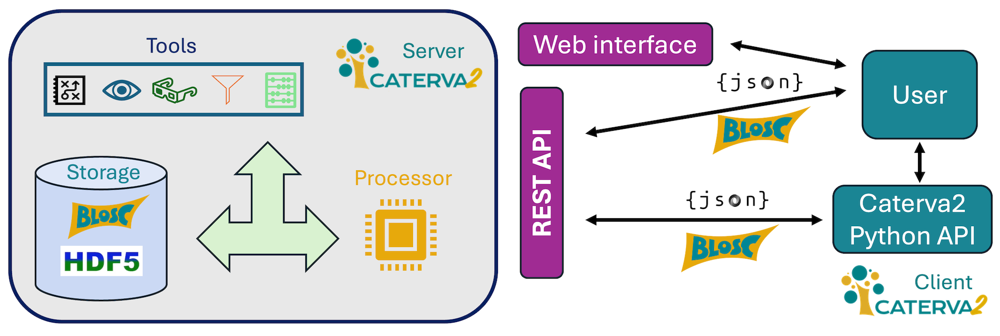
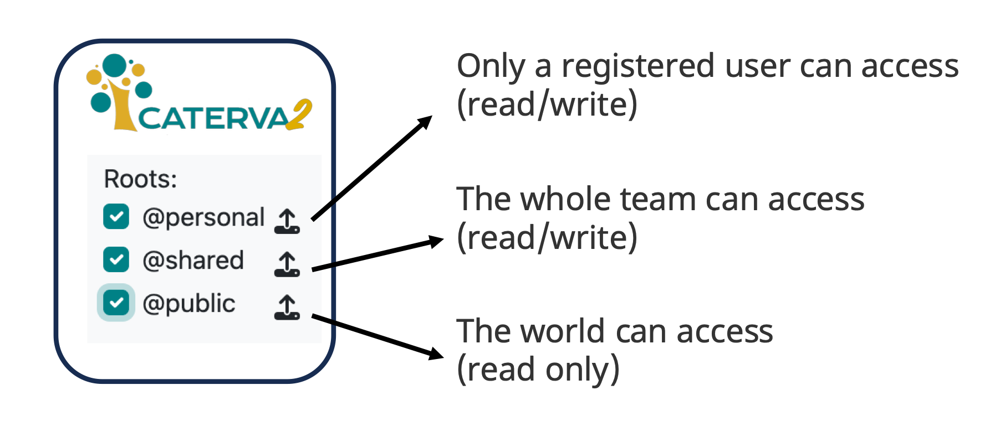
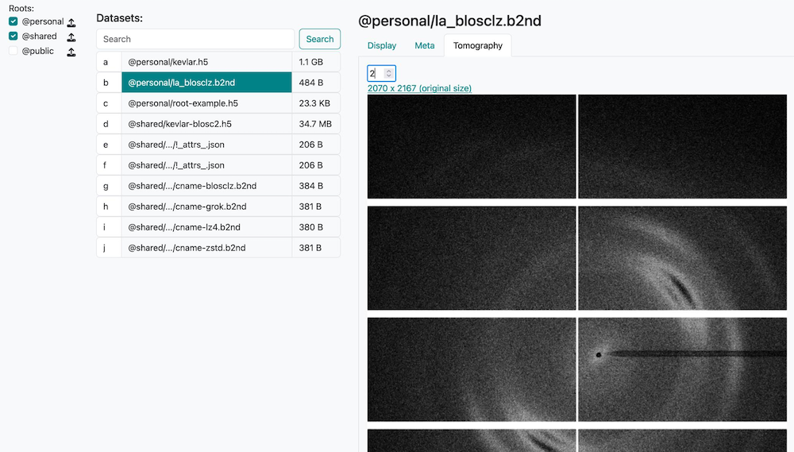
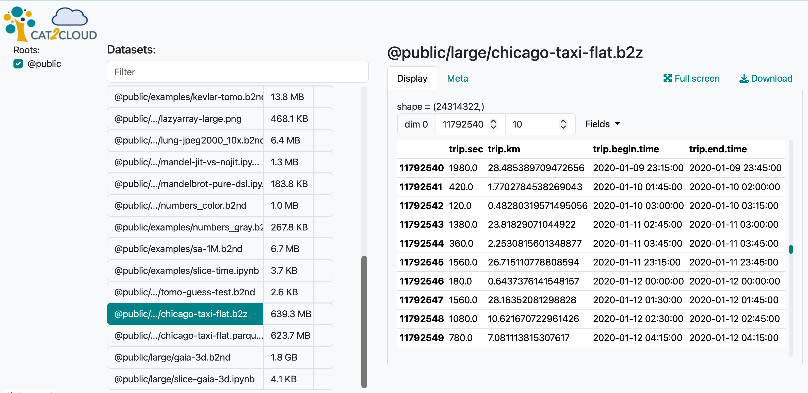

# Caterva2: On-demand access to Blosc2/HDF5 data repositories

## What is it?

Caterva2 is a high-performance service for sharing, computing on, and federating [Blosc2][] (NDArrays and CTables) and [HDF5][] datasets with authenticated users, work groups, or the public. It turns data repositories into an active computing platform with multiple interfaces: a modern Web GUI, embedded JupyterLite, a Python API, a CLI, and a REST API.



### Key Capabilities

* ⚡ **Server-Side Compute & Querying**: Fancy coordinate gathering (`indices`), SQL-like column filtering (`where`), and server-side sorting (`blosc2.sort_by()`)—compute runs next to the storage in a single network round-trip.
* 📊 **First-Class Blosc2 CTable (`.b2z`) Support**: Rich structured tables with dedicated `Table` abstractions, column filtering, and ascending/descending sorting.
* 📁 **Hierarchical Virtual Roots**: Browse inside `.b2z` containers (TreeStore, DictStore) and `.h5` (HDF5) files as mountable virtual roots without copying or converting files.
* 🚀 **Concurrent Chunk-by-Chunk Ingestion**: Pre-allocate empty array frames (`Client.lay_out()`) and fill slots concurrently (`Client.fill_chunk()`) with HTTP 409 conflict resolution and atomic publishing.
* 🌐 **Federated Peer Caching (`c2cache`)**: Dynamic peer mounts and transparent local caching with fine-grained per-cache locks and scoped quotas across cluster nodes.
* 📓 **Embedded JupyterLite & Web UI**: Zero-install in-browser analysis with automatic bootstrap cell injection, standalone save-back, and keyboard/touch navigation.
* 🔒 **Multi-Tenant Security & Quotas**: 3-tier access control (`@personal`, `@shared`, `@public`), token authentication, and per-user upload quotas.



Use it remotely or locally to access datasets in a directory hierarchy or share them across your network. The Python API is recommended for building custom clients, while the Web GUI offers a user-friendly interface for browsing datasets and visualizing multidimensional data.



[Blosc2]: https://www.blosc.org/pages/blosc-in-depth/
    "What Is Blosc? (Blosc blog)"

[HDF5]: https://www.hdfgroup.org/solutions/hdf5/
    "HDF5 (HDF Group)"

## Caterva2 Clients

The Caterva2 package provides a lightweight library for building custom clients. Choose the interface that best fits your needs:

- **[Web GUI](https://ironarray.io/caterva2-doc/tutorials/web-client.html)** - Browser-based interface for dataset exploration, sorting, and embedded JupyterLite
  

- **[Python API](https://ironarray.io/caterva2-doc/tutorials/API.html)** - Programmatic access for arrays, tables, and ingestion
  ```python
  import caterva2 as cat2

  client = cat2.Client("https://cat2.cloud/demo")

  # 1. NDArray slicing & server-side coordinate gathering
  ds = client.get("@public/examples/numbers_color.b2nd")
  print(ds[0:2, 0:2])
  points = ds[[0, 1], [0, 1]]  # Gathered on server in a single round-trip!

  # 2. First-class CTable structured table queries
  table = client.get("@public/large/chicago-taxi-flat.b2z")
  print(table[-5:])  # Instantly slices the last 5 rows of 24M records as a blosc2.CTable
  ```

- **[Command-line client](https://ironarray.io/caterva2-doc/tutorials/cli.html)** - Terminal interface
  ```sh
  cat2-client --server https://cat2.cloud/demo info @public/examples/numbers_color.b2nd
  ```

- **[REST API](https://ironarray.io/caterva2-doc/tutorials/RESTAPI.html)** - HTTP interface (use with [Postman](https://www.postman.com/), [curl](https://curl.se/), etc.)
  See the live API docs at [cat2.cloud/demo/docs](https://cat2.cloud/demo/docs).

All interfaces support authentication for accessing private datasets (see "User authentication" below).

## Installation

### For Users

**Client only** (Python API and CLI tools):
```sh
pip install caterva2[clients]
```

**Test the installation** (includes client, server, and test suite):
```sh
pip install caterva2[tests]
python -m caterva2.tests
CATERVA2_SECRET=c2sikrit python -m caterva2.tests  # with authentication
```

### For Developers

**Install from source** (includes server, clients, and test suite):
```sh
git clone https://github.com/ironArray/Caterva2
cd Caterva2
pip install -e .[tests]
python -m pytest
CATERVA2_SECRET=c2sikrit python -m pytest  # with authentication
```

### Available Extras

Append `[extra1,extra2,...]` to any install command:

- `clients` - CLI and terminal tools
- `server` - Server service (includes C2Cache, FastAPI, SQLite, PyArrow)
- `hdf5` - HDF5 support (h5py, b2h5py, hdf5plugin)
- `tests` - Test suite (includes server, clients, and test fixtures)
- `blosc2-plugins` - JPEG 2000 support via blosc2-grok

**Note:** Test runs create a `_caterva2_tests` directory with state files for inspection.

### Federated Peer Caching (C2Cache)

C2Cache is bundled directly as an internal Caterva2 provider; it requires no separate package or installation extra. It activates whenever the server configuration contains at least one `[[server.peer]]` entry. Each configured peer exposes that server's `@public` root under a configured local name and transparently caches requested chunks on demand with fine-grained per-cache locks and scoped LRU quotas. See `caterva2-server.sample.toml` for configuration options.

## Quick start

See [Caterva2 documentation](https://ironarray.io/caterva2-doc/index.html) for detailed tutorials.

**Setup:**
1. Install with server and client support:
   ```sh
   pip install caterva2[server,clients]
   ```

2. Copy configuration files:
   - `caterva2.sample.toml` → `caterva2.toml` (client config)
   - `caterva2-server.sample.toml` → `caterva2-server.toml` (server config)

   Place in current directory, `~/`, or `/etc/`. Use `--conf` to specify alternate locations.

3. Start the server:
   ```sh
   CATERVA2_SECRET=c2sikrit cat2-server &
   ```
   `CATERVA2_SECRET` is required for user authentication (see below).

**Server directory structure:**

```sh
tree _caterva2
_caterva2
└── state
    ├── db.json          # metadata
    ├── db.sqlite        # metadata
    ├── media            # temporary files for web GUI
    ├── personal         # user-specific datasets
    ├── public           # publicly shared datasets
    └── shared           # group-shared datasets
```

**Populate with example datasets:**

```sh
cp -r root-example/ _caterva2/state/public/
```

Browse them at [http://localhost:8000/?roots=@public](http://localhost:8000/?roots=@public)

### User authentication

Enable authentication by setting `CATERVA2_SECRET` when starting the server. This enables user management but does not verify email addresses or support password recovery.

**Create a user:**
```sh
cat2-admin adduser user@example.com foobar11
```

**Authenticate clients:**
- **Web GUI** - Login prompt on access
- **Python API** - Pass credentials to client:
  ```python
  client = cat2.Client("http://localhost:8000", ("user@example.com", "foobar11"))
  ```
- **CLI** - Use `--user` and `--pass` options

### Command-line client

**List available roots:**
```sh
cat2-client --user user@example.com --pass foobar11 roots
```
<details>
<summary>Show output</summary>

```
@public
@personal
@shared
```
</details>

**List datasets:**
```sh
cat2-client list @public
```
<details>
<summary>Show output</summary>

```
examples/README.md
examples/Wutujing-River.jpg
examples/cat2cloud-brochure.pdf
examples/cube-1k-1k-1k.b2nd
examples/cubeA.b2nd
examples/cubeB.b2nd
examples/dir1/ds-2d.b2nd
examples/dir1/ds-3d.b2nd
examples/dir2/ds-4d.b2nd
examples/ds-1d-b.b2nd
examples/ds-1d-fields.b2nd
examples/ds-1d.b2nd
examples/ds-2d-fields.b2nd
examples/ds-hello.b2frame
examples/ds-sc-attr.b2nd
examples/gaia-ly.b2nd
examples/hdf5root-example.h5
examples/ironpill_nb.ipynb
examples/kevlar-tomo.b2nd
examples/lazyarray-large.png
examples/lung-jpeg2000_10x.b2nd
examples/numbers_color.b2nd
examples/numbers_gray.b2nd
examples/sa-1M.b2nd
examples/slice-time.ipynb
examples/tomo-guess-test.b2nd
large/gaia-3d.b2nd
large/slice-gaia-3d.ipynb
```
</details>

**Browse directory tree:**
```sh
cat2-client tree @public
```
<details>
<summary>Show output</summary>

```
├── examples
│   ├── README.md
│   ├── Wutujing-River.jpg
│   ├── cat2cloud-brochure.pdf
│   ├── cube-1k-1k-1k.b2nd
│   ├── cubeA.b2nd
│   ├── cubeB.b2nd
│   ├── dir1
│   │   ├── ds-2d.b2nd
│   │   └── ds-3d.b2nd
│   ├── dir2
│   │   └── ds-4d.b2nd
│   ├── ds-1d-b.b2nd
│   ├── ds-1d-fields.b2nd
│   ├── ds-1d.b2nd
│   ├── ds-2d-fields.b2nd
│   ├── ds-hello.b2frame
│   ├── ds-sc-attr.b2nd
│   ├── gaia-ly.b2nd
│   ├── hdf5root-example.h5
│   ├── ironpill_nb.ipynb
│   ├── kevlar-tomo.b2nd
│   ├── lazyarray-large.png
│   ├── lung-jpeg2000_10x.b2nd
│   ├── numbers_color.b2nd
│   ├── numbers_gray.b2nd
│   ├── sa-1M.b2nd
│   ├── slice-time.ipynb
│   └── tomo-guess-test.b2nd
└── large
    ├── gaia-3d.b2nd
    └── slice-gaia-3d.ipynb
```
</details>

**Get dataset info:**
```sh
cat2-client info @public/examples/ds-1d.b2nd
```
<details>
<summary>Show output</summary>

```
Getting info for @public/examples/ds-1d.b2nd
shape : [1000]
chunks: [100]
blocks: [10]
dtype : int64
nbytes: 7.81 KiB
cbytes: 4.90 KiB
ratio : 1.59x
mtime : 2026-01-15T17:04:50.823466Z
cparams:
  codec  : ZSTD (5)
  clevel : 1
  filters: [SHUFFLE]
```
</details>

For more commands: `cat2-client --help`

## Documentation

For tutorials, API references, and examples, visit the [Caterva2 documentation](https://ironarray.io/caterva2-doc/index.html).
