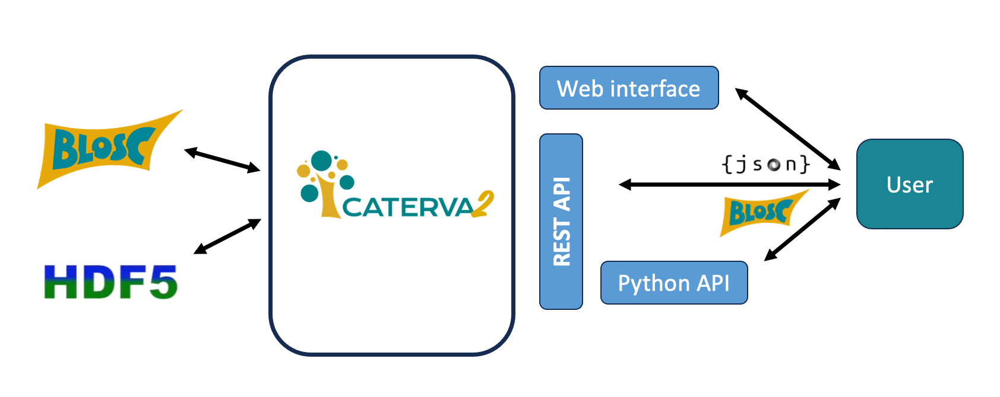

# Caterva2: On-demand access to Blosc2/HDF5 data repositories

## What is it?

Caterva2 is a service meant for serving [Blosc2][] and [HDF5][] datasets among authenticated users, work groups, or the public.  There are several interfaces to Caterva2, including a web GUI, a REST API, a Python API, and a command-line client.



It can be used either remotely or locally, as a simple way to access datasets in a directory hierarchy, or to share them with other users in the same network.


The Python API is the recommended way for building your own Caterva2 clients, whereas the web client provides a more user-friendly interface for browsing and accessing datasets.


[Blosc2]: https://www.blosc.org/pages/blosc-in-depth/
    "What Is Blosc? (Blosc blog)"

[HDF5]: https://www.hdfgroup.org/solutions/hdf5/
    "HDF5 (HDF Group)"

## Caterva2 Clients
The main role of the Caterva2 package is to provide a simple and lightweight library to build your own Caterva2 clients. The variety of interfaces available allows you to choose the one that best fits your needs. For example, querying a dataset from source can be accomplished :
- Via the [web GUI](https://ironarray.io/caterva2-doc/tutorials/web-client.html) using a browser 
- Via the [Python API](https://ironarray.io/caterva2-doc/tutorials/API.html)
```
client = cat2.Client("https://cat2.cloud/demo")
client.get("@public/examples/tomo-guess-test.b2nd")
```
- Via the [command line client](https://ironarray.io/caterva2-doc/tutorials/cli.html)
```sh
cat2cli info @public/kevlar/entry/data/data.b2nd
```
- Via the [REST API](https://ironarray.io/caterva2-doc/tutorials/RESTAPI.html) using a REST client like [Postman](https://www.postman.com/) or [curl](https://curl.se/) (see [here](https://cat2.cloud/demo/docs)).

In addition, as Caterva2 supports authentication, all client interfaces expose a way to log in and access private datasets. Administration of authenticated users may be done using the internal mechanics of Caterva2 (see section "User authentication" below).

## Installation

You may install Caterva2 in several ways:

- Pre-built wheel from PyPI:

  ```sh
  python -m pip install caterva2
  ```

- Wheel built from source code:

  ```sh
  git clone https://github.com/ironArray/Caterva2
  cd Caterva2
  python -m build
  python -m pip install dist/caterva2-*.whl
  ```

- Developer setup:

  ```sh
  git clone https://github.com/ironArray/Caterva2
  cd Caterva2
  python -m pip install -e .
  ```

When a user uses a client (web GUI, REST API, Python API, or command line) to query datasets, the client will connect to a Caterva2 **subscriber** service, which
accesses the relevant datasets stored either locally or remotely. The subscriber services may be managed via the command line by installing the `caterva2` package with the `[subscriber]` extra feature (we also wish to use the command line client, so we will also install the `clients` extra too):

  ```sh
  python -m pip install caterva2 [subscriber, clients]
  ```
In general, if you intend to run Caterva2 services, client programs, or the test suite, you need to enable the proper extra features by appending `[feature1,feature2...]` to the last argument of `pip` commands above.  The following extras are supported:

- `subscriber` for running the Caterva2 subscriber service
- `clients` to use Caterva2 client programs (command-line or terminal)
- `blosc2-plugins` to enable extra Blosc2 features like Btune or JPEG 2000 support
- `plugins` to enable web GUI features like the tomography display
- `tools` for additional utilities like `cat2import` and `cat2export` (see below)
- `tests` if you want to run the Caterva2 test suite

### Testing

After installing with the `[tests]` extra, you can quickly check that the package is sane by running the test suite (that comes with the package):

```sh
python -m caterva2.tests -v
```

You may also run tests from source code:

```sh
cd Caterva2
python -m pytest -v
```

Tests will use a copy of Caterva2's `root-example` directory.  After they finish, state files will be left under the `_caterva2_tests` directory for inspection (it will be re-created when tests are run again).

In case you want to run the tests with your own running daemons, you can do:

```shell
env CATERVA2_USE_EXTERNAL=1 python -m caterva2.tests -v
```

Neither `root-example` nor `_caterva2_tests` will be used in this case.

## Quick start

(Find more detailed step-by-step [tutorials](Tutorials) in Caterva2 documentation.)

For the purpose of this quick start, let's use the datasets within the `root-example` folder:

```sh
cd Caterva2
ls -F root-example/
```

```
README.md               dir2/                   ds-1d-fields.b2nd       ds-2d-fields.b2nd       ds-sc-attr.b2nd
dir1/                   ds-1d-b.b2nd            ds-1d.b2nd              ds-hello.b2frame
```

Now:

- create a virtual environment and install Caterva2 with the `[subscriber,clients]` extras (see above).
- copy the configuration file `caterva2-standalone.sample.toml` to `caterva2.toml`.

For more advanced configuration options, see the fully documented `caterva2.sample.toml` file (see also [caterva2.toml](caterva2.toml) in Caterva2 tutorials). Subscribers (and clients, to a limited extent) may get their configuration from a `caterva2.toml` file at the current directory (or an alternative file given with the `--conf` option).

Then run the subscriber:

```sh
CATERVA2_SECRET=c2sikrit cat2sub &  # subscriber
```
The `CATERVA2_SECRET` environment variable is obligatory and is explained below in the following section.

### User authentication
The Caterva2 subscriber includes some support for authenticating users.  To enable it, run the subscriber with the environment variable `CATERVA2_SECRET` set to some non-empty, secure string that will be used for various user management operations. Note that new accounts may be registered, but their addresses are not verified.  Password recovery does not work either.

To create a user, you can use the `cat2adduser` command line client. For example:

```sh
cat2adduser user@example.com foobar11
```

Client queries then require the same user credentials:
- The user will be prompted to login when accessing the web client using a browser
- The Python API client can be authenticated in the following way:
```
client = cat2.Client("https://cat2.cloud/demo", ('user@example.com', 'foobar11'))
```
- The command line client can be authenticated with the `--user` and `--pass` options

### The command line client
Now that the services are running, we can use the `cat2cli` client to talk
to the subscriber. In another shell, let's list all the available roots in the system:

```sh
cat2cli --user "user@example.com" --pass "foobar11" roots
```

```
@public (subscribed)
@personal (subscribed)
@shared (subscribed)
```
First let's upload a file from the `root-example`folder to the `@personal` root:

```sh
cat2cli --username user@example.com --password foobar11 upload root-example/ds-1d.b2nd @personal/ds-1d.b2nd
```

Now, one can list the datasets in the `@personal` root and see that the uploaded file appears

```sh
cat2cli --username user@example.com --password foobar11 list @personal
>> ds-1d.b2nd
```

Let's ask the subscriber for more info about the dataset:

```sh
cat2cli --username user@example.com --password foobar11 info @personal/ds-1d.b2nd
```

```
Getting info for @personal/ds-1d.b2nd
{
    'shape': [1000],
    'chunks': [100],
    'blocks': [10],
    'dtype': 'int64',
    'schunk': {
        'cbytes': 5022,
        'chunkshape': 100,
        'chunksize': 800,
        'contiguous': True,
        'cparams': {'codec': 5, 'codec_meta': 0, 'clevel': 1, 'filters': [0, 0, 0, 0, 0, 1], 'filters_meta': [0, 0, 0, 0, 0, 0], 'typesize': 8, 'blocksize': 80, 'nthreads': 1, 'splitmode': 1, 'tuner': 0, 'use_dict': False, 'filters, meta': [[1, 0]]},
        'cratio': 1.5929908403026682,
        'nbytes': 8000,
        'urlpath': '/home/lshaw/Caterva2/_caterva2/sub/personal/2fa87091-84c6-44f9-a57e-7f04290630b1/ds-1d.b2nd',
        'vlmeta': {},
        'nchunks': 10,
        'mtime': None
    },
    'mtime': '2025-05-29T09:11:26.860956Z'
}
```

This command returns a JSON object with the dataset's metadata, including its shape, chunks, blocks, data type, and compression parameters. The `schunk` field contains information about the underlying Blosc2 super-chunk that stores the dataset's data.

There are more commands available in the `cat2cli` client; ask for help with:

```sh
cat2cli --help
```

### Docs
To see how to use the Python and REST API and web GUI, check out the [Caterva2 documentation](https://ironarray.io/caterva2-doc/tutorials/API.html). You'll also find more information on how to use Caterva2, including tutorials, API references, and examples [here](https://ironarray.io/caterva2-doc/index.html).

That's all folks!
