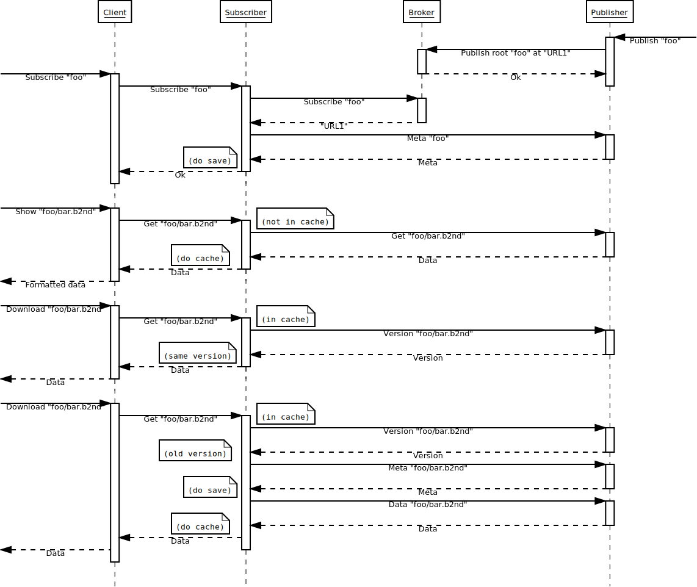

# Minimal specifications

## Introduction

This document describes the minimal specifications for the project.  It is meant to describe the functionality of the client, whereas the implementation details of the publisher and subscriber are left to the developer (as long as the specification works).

## Vocabulary

- **Root**: The root of a group of datasets that are published together.  It is identified by a name.
- **Dataset**: A dataset is a file that is published by the publisher.  It is identified by a path.
  E.g. `foo/bar.b2nd` is a dataset path with root `foo`.
- **Broker**: The broker is the entity that manages the communication between publishers and subscribers.  It is also responsible for keeping a list of roots available to subscribers.
- **Publisher**: The publisher is the entity that makes datasets available to subscribers.  It is responsible for creating a root and adding datasets to it.
- **Subscriber**: The subscriber is the entity that follows changes in a root and allows the download of datasets from publishers.
- **Client**: The client is a subscriber consumer (e.g. a command line tool) for the user to access the datasets; it connects to a subscriber.

## Services

The three services (broker, publisher and subscriber) have a number of common options:

- `--http`: the hostname and port that it listens, e.g. `localhost:8000`
- `--loglevel`: by default `warning`
- `--statedir`: directory where to store the service state files (cache, logs, pid file, etc.)
- `--broker`: the hostname and port where the broker runs (only for publisher and subscriber)
- `--daemon`: whether the service daemonizes itself (false by default)

In production deployments it's recommended to use Systemd services.

## Client commands

The client must implement the following commands:

- `roots`: List all the available roots in a broker.
- `subscribe <root>`: Request access to the datasets in a root.
- `list <root>`: List all the available datasets in a root.  Needs to be subscribed to the root.
- `url <root>`: Publisher URL for the REST API that serves the root.
- `info <dataset>`: Get metadata about a dataset.
- `show <dataset[slice]>`: Show the data of a dataset. `slice` is optional.
- `download <dataset> <output_dir>`: Get the data of a dataset and save it to a local `output_dir` folder.

## Configuration

There should be a configuration file (by default $CWD/caterva2.toml) where the configuration for each service is specified. For example:

```
[broker]
http = "localhost:8000"
statedir = "_caterva2/bro"
loglevel = "warning"

[publisher.1]
http = "localhost:8001"
statedir = "_caterva2/pub"
loglevel = "warning"
name = "foo"
root = "root-examples"

[subscriber.1]
http = "localhost:8002"
statedir = "_caterva2/sub"
loglevel = "warning"
```


## Client implementation

The client must be implemented in Python 3 (3.10 being the minimal supported version).  It must be a library with a command line interface that connects to a subscriber and sends commands to it.  The subscriber must be running before the client is started. If the subscriber is not running, the client must print an error message and exit. The publisher is expected to be running before the subscriber is started; if not, the subscriber will only serve its cached data.

### Command line interface

- When a `roots` command is issued, the client must send a request to the subscriber to list all the available roots.  The subscriber will reply with a list of roots (if possible, with flags indicating if a root is subscribed).

- When a `subscribe` command is issued, the client must send a request to the subscriber to subscribe to the given root.  The subscriber will reply with a success or failure message.  If successful, the subscriber must store the root metadata in its local cache.

- When a `list` command is issued, the client must send a request to the subscriber to list the datasets in the given root.  The subscriber will reply with a list of datasets.

- When a `url` command is issued, the client must send a request to the subscriber to get the URL of the REST API of the root.  The subscriber will reply with the URL.

- When an `info` command is issued, the client must send a request to the subscriber to get the metadata of the given dataset.  The subscriber will reply with the [metadata](#metadata).  See below for the [metadata](#metadata) format.

- When a `show` command is issued, the client must send a request to the subscriber to retrieve the data of the given dataset.  The subscriber will reply with the data.  The format is inferred from the extension of the output file: `.b2nd` for Blosc2 NDim and `.b2frame` for Blosc2 frames; an n-dim NumPy array and a 1-dim NumPy array will be shown respectively.  All other extensions will be delivered as a raw buffer (e.g. `foo/path/README.md` will be shown as text).

- When a `download` command is issued, the client must send a request to the subscriber to retrieve the data of the dataset.  The subscriber will reply with the data and client should be responsible to store it in its local `<output_dir>` folder. The name of the file will be the same as the dataset path (e.g. `foo/bar.b2nd` will be stored as `<output_dir>/foo/bar.b2nd`).

The sequence diagram below summarizes how different messages flow between the components of the system.



## Cache management details

Whenever the subscriber gets a request to `subscribe` to a root, it must check if metadata (not the data itself) for all the datasets in a root is already in the cache.  If it is, it must check if the root has changed in the publisher.  If it has, it must update the cache.  If it hasn't, it must use the cached data.  If the root metadata is not in the cache, it must fetch it and add it to the cache.

Metadata can be fetched and consolidated as uninitialized datasets in cache by using the API described in the [Metadata](#metadata) section below.

There will be not an in-memory cache in the subscriber, but a folder in the filesystem.  The reason is that cache files that are accessed frequently will be cached automatically by the OS, so there is no need to duplicate it (at least initially).  The folder will be called `$(cwd)/_caterva2/cache/` and it will contain the metadata and data of the datasets.  The data and metadata will be stored in Blosc2 format.

Updates to the cache for a given root should happen in an atomic fashion.  The subscriber should get and store all new required information in a temporary location of the same device where the current database and cache are located, and only once the storage operation is complete shall it replace the old data.

When a publisher has to serve a data file that is not in Blosc2 format (e.g. a text file), it will be compressed locally (initially in one go with the technique shown in [section "Compressing general files"](#compressing-general-files)), and stored in `$(cwd)/_caterva2/cache/`. The file will be named `$(dataset_path).b2` (e.g. `foo/bar.txt` will be stored as `$(cwd)/_caterva2/cache/foo/bar.txt.b2`).

The publisher will serve the data in its own cache as-is, without decompressing it. The subscriber will store and send the data as-is too, and only the client will be responsible to decompress it (it will receive a Blosc2 frame than can be opened with `blosc2.open()` and data can be retrieved using slicing).

Whenever a `show` or `download` command is issued, the subscriber must check if the data in dataset is already in the cache.  If it is, it must check if the dataset has changed in the publisher; for this, it will ask the publisher for the `mtime` in the dataset, and compare it against the `mtime` field in the general JSON database.  If it has changed, it must update the cache.  If it hasn't, it must use the cached data.  If the data of the dataset is not in the cache, it must fetch it and add it to the cache.

`show` or `download` commands will make the subscriber download the whole data from publisher and will store it in its cache folder. When a `slice` is provided (only for the `show` command), subscriber will download only the chunks in `[slice]` that are not in cache yet.

## Metadata

- `meta`: The metadata of the dataset.

`.b2nd` files are read as `NDArray` instances, and `meta` is a dictionary with the following fields:

```
In [15]: b = blosc2.uninit(shape=[1000], chunks=[100], blocks=[10], dtype=np.int16)
In [16]: dict(shape=b.shape, chunks=b.chunks, blocks=b.blocks, dtype=b.dtype, cparams=b.schunk.cparams)
Out[16]:
{'shape': (1000,),
 'chunks': (100,),
 'blocks': (10,),
 'dtype': dtype('int16'),
 'cparams': {'codec': <Codec.ZSTD: 5>,
  'codec_meta': 0,
  'clevel': 1,
  'use_dict': 0,
  'typesize': 2,
  'nthreads': 4,
  'blocksize': 20,
  'splitmode': <SplitMode.ALWAYS_SPLIT: 1>,
  'filters': [<Filter.NOFILTER: 0>,
   <Filter.NOFILTER: 0>,
   <Filter.NOFILTER: 0>,
   <Filter.NOFILTER: 0>,
   <Filter.NOFILTER: 0>,
   <Filter.SHUFFLE: 1>],
  'filters_meta': [0, 0, 0, 0, 0, 0]}}
```

For `.b2frame`, or `.b2` files (the latter is mandatory as an additional file extension in generic files), they are read as `SChunk` instances, and `meta` is a dictionary with the following fields:

```
In [17]: sc = blosc2.SChunk(chunksize=100)
In [18]: sc.fill_special(8 * 100, special_value=blosc2.SpecialValue.UNINIT)
Out[18]: 8
In [19]: dict(chunksize=c.chunksize, typesize=c.typesize, cparams=c.cparams)
Out[19]:
{'chunksize': 100,
 'typesize': 1,
 'cparams': {'codec': <Codec.ZSTD: 5>,
  'codec_meta': 0,
  'clevel': 1,
  'use_dict': 0,
  'typesize': 1,
  'nthreads': 4,
  'blocksize': 0,
  'splitmode': <SplitMode.ALWAYS_SPLIT: 1>,
  'filters': [<Filter.NOFILTER: 0>,
   <Filter.NOFILTER: 0>,
   <Filter.NOFILTER: 0>,
   <Filter.NOFILTER: 0>,
   <Filter.NOFILTER: 0>,
   <Filter.SHUFFLE: 1>],
  'filters_meta': [0, 0, 0, 0, 0, 0]}}
```

- `vlmeta`: The so-called variable length metadata (aka user metadata).  This is the same for both `.b2nd` and `.b2frame` files. E.g.:

```
In [20]: b.schunk.vlmeta['new_meta'] = "my data"
In [21]: dict(b.schunk.vlmeta)
Out[21]: {'new_meta': 'my data'}
```

## Root data repository example

You can find an example of a data root in the `root-example` folder.  It contains several datasets:

- `README.md`: A text file.

- `ds-hello.b2frame`: A SChunk containing a data buffer.  Constructed as:

      blosc2.SChunk(chunksize=100, data=b"Hello world!"*100, urlpath="ds-hello.b2frame", mode="w")

- `ds-1d.b2nd`: A 1D array (int64). Constructed as:

      a = np.arange(1000, dtype="int64")
      blosc2.asarray(a, chunks=(100,), blocks=(10,), urlpath="ds-1d.b2nd", mode="w")

- `ds-1d-b.b2nd`: A 1D array (6-byte strings). Constructed as:

      a = np.array([b"foobar"] * 1000)
      blosc2.asarray(a, chunks=(100,), blocks=(10,), urlpath="ds-1d-b.b2nd", mode="w")

- `ds-sc-attr.b2nd`: A scalar (string) with variable-length metalayers (user attributes). Constructed as:

      a = np.str_("foobar")
      b = blosc2.asarray(a, urlpath=path / "ds-sc-attr.b2nd", mode="w")
      for k, v in dict(a=1, b="foo", c=123.456).items():
          b.schunk.vlmeta[k] = v

- `dir1/ds-2d.b2nd`: A 2D array (uint16).  Constructed as:

      a = np.arange(200, dtype="uint16").reshape(10, 20)
      blosc2.asarray(a, chunks=(5, 5), blocks=(2, 3), urlpath="dir1/ds-2d.b2nd", mode="w")

- `dir1/ds-3d.b2nd`: A 3D array (float32). Constructed as:

      a = np.arange(60, dtype="float32").reshape(3, 4, 5)
      blosc2.asarray(a, chunks=(2, 3, 4), blocks=(2, 2, 2), urlpath="dir1/ds-3d.b2nd", mode="w")

- `dir2/ds-4d.b2nd`: A 4D array (complex128). Constructed as:

      a = np.arange(120, dtype="complex128").reshape(2, 3, 4, 5)
      blosc2.asarray(a+a*1j, chunks=(1, 2, 3, 4), blocks=(1, 2, 2, 2), urlpath="dir2/ds-4d.b2nd", mode="w")

## Communication failures

As we will be checking for the validity of the data in the cache (see above), we will be able to implement communication failure handling in a next version. For the time being, we will just assume that the communication is always successful, but we can start thinking on actions to be done when something fails.

This is a list of possible actions:

* When a subscriber sends a command to the publisher, it will wait for a reply.  If the communication fails or a reply is not received in a certain amount of time, the subscriber will just serve its cached data to the client.  In the latter case, if there is no cached data, it will return an error message instead.

* As a particular case of the former, when the client requests data from the subscriber using `show` or `download`, the subscriber should first get and store locally all the data from the publisher needed to fulfill the client's request.  If the transfer of any piece of data fails, the subscriber should return an error message before starting the transfer of data to the client.

* When a client sends a command to the subscriber, it will wait for a reply.  If the communication fails or a reply is not received in a certain amount of time, the client will print an error message and exit.

* When a subscriber needs to update its database and cache for a given root, if the communication fails or a reply from the publisher is not received in a certain amount of time, or there is some other local problem (like lack of storage space), since the update should be atomic, the temporary data should be discarded and the cached one used according to the previous points.

* When a publisher is down, and the root files are added/updated, when the publisher comes up again, it should announce the new/updated root files to the broker.  The broker should then notify the subscribers that the root files have changed, and the subscribers should update their local database and cache.


TODO: think about other situations.

## Data transmission

Whenever possible, data should be transmitted in [Blosc2 frame format](https://github.com/Blosc/c-blosc2/blob/main/README_CFRAME_FORMAT.rst).

## Compressing general files

For compressing general files, we can use the `SChunk` class.  E.g.:

```
In [1]: text = open("root-example/README.md", mode="rb").read()

In [2]: import blosc2

In [3]: schunk = blosc2.SChunk(urlpath="root-example/README.md.b2", mode="w")

In [4]: schunk.append_data(text)
Out[4]: 1

In [5]: text == blosc2.open("root-example/README.md.b2")[:]
Out[5]: True

```

For the time being, `.b2` files can be made in one shot (i.e. a single `schunk.append_data()` call), but in a next version we should be able to compress files larger than available memory by using a chunked algorithm (i.e. reading and writing chunk-by-chunk).

## Internal database

There will be an internal database for publishers and subscribers for storing different metadata.  It will be a JSON file called `$(cwd)/_caterva2/db.json` and it will contain the following fields (J. David: please check this):

* `version`: The version of the database.
* `roots`: A list of roots.  Each root is a dictionary with the following fields:
  * `name`: The name of the root.
  * `url`: The publisher URL where the root is accessible (e.g. `http://localhost:5000/foo`).
  * `subscribed`: A boolean indicating if the root is subscribed.
  * `mtime`: The modification time of the root in the publisher.
  * `datasets`: A list of datasets.  Each dataset is a dictionary with the following fields:
    * `path`: The path of the dataset.
    * `mtime`: The modification time of the dataset in the publisher.
    * `meta`: The metadata of the dataset.
    * `vlmeta`: The variable length metadata of the dataset.

The ``meta`` and ``vlmeta`` fields above are the same as described in the [Metadata](#metadata) section above. They are purely informational at this point, but they will be used in a next version for searching and filtering datasets ([TinyDB](https://tinydb.readthedocs.io/en/latest/) can be used for this).

## TODO

- Broker: add API to remove a root (only the publisher that creates it can remove it)
